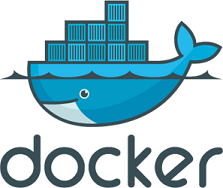

# Deploying CommandBox

CommandBox may also be used in production or continuous deployments, since it allows you to orchestrate your server environment. This eliminates dependency on hardware, and makes your CFML applications more portable, as a whole.&#x20;


For advanced server configurations, be sure to check out the [`CFConfig` module](https://cfconfig.ortusbooks.com/).


Since the startup of a CommandBox server allows you specify a host and server port, you can easily bind your server to a machine IP address and specify which port it should serve the application on. This allows you to proxy traffic to the application from IIS, Apache, or NGINX and even allows you to serve traffic directly on HTTP port 80 or 443, if you choose.

Container-based deployments are also supported, with official Docker Images and a buildpack for Heroku/Dokku.

[_Click to learn more._](docker.md)

[_Click to learn more._](heroku.md)

.png>)

[_Click to learn more._](amazon-lightsail.md)
