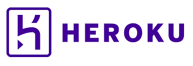

# Heroku



The [Heroku buildpack for CommandBox](https://github.com/ortus-solutions/heroku-buildpack-commandbox) will allow you to deploy your CFML applications directly to [Heroku](https://www.heroku.com) (or to [Dokku](http://dokku.viewdocs.io/dokku/) hosts) using CommandBox to manage your CFML engine. It allows you to specify your custom server configuration settings using the CommandBox server API, avoiding additional script and configuration files during the Heroku deployment process.

## Usage

Deploy a sample app:


## Configuration

Below are the configuration options for both Heroku and Dokku environments.

### Heroku Configuration

Create your heroku app:

```
heroku apps:create myapp.mydomain.com
```

Heroku will return two URLS - the app domain ( you can configure a custom domain later ), and the heroku repository remote url which is configured to deploy your application.

Set up a new remote for this url:

```
git remote add heroku https://git.heroku.com/myapp.mydomain.com.git
```

Set your buildpack for Heroku with the command

```
heroku buildpacks:set https://github.com/ortus-solutions/heroku-buildpack-commandbox.git
```

### Dokku Configuration

Create a file in the root of your project named .buildpacks and add the following to that file:

```
https://github.com/ortus-solutions/heroku-buildpack-commandbox.git
```

Now configure a new Git remote for your Dokku deployment ( Dokku will create the repo automatically if it doesn't exist ):

```
git remote add dokku https://dokku.mydomain.com/myapp.mydomain.com.git
```

## Deployment

Both Heroku and Dokku use a git push to the repository to trigger deployment. By default the master branch is the only branch triggered for deployment with a push. A simple push the repository triggers the deployment (using the remote name you set in configuration):

```
git push heroku master
```

You may override this by specifying a branch in your push to act as master (e.g. - deploying to a staging instance):

```
git push heroku yourbranch:master
```

Once deployment is returned as successful, you may receive NGINX 502 errors for up to 60 seconds as the CommandBox server starts up for the first time.

For zero-downtime deployments on Dokku, create [a `CHECKS` file](http://dokku.viewdocs.io/dokku/deployment/zero-downtime-deploys/) in the root of your project, which will ensure that your application is up and running before bringing the container online during redeployment.

For implementing a zero-downtime deployment strategy on Heroku, you can customize the `postdeploy` script in your [`app.json` file](https://devcenter.heroku.com/articles/app-json-schema) or use [Heroku's preboot](https://devcenter.heroku.com/articles/preboot) feature

### Command Line Access to Your App

You may run additional commands on your server environment or enter a terminal to connect to your dyno by simply typing `heroko run bash` from the root directory of your project.

### Heap Size Settings

Your heap size settings will need to be configured according to the dyno size ( Heroku ) or available memory of the Dokku instance. By default, Commandbox uses a heap size of 512MB, which is larger than the free/hobby tier for Heroku. A heap size setting larger than that allocated to the dyno will cause a Commandbox startup failure.

See [Heroku's environmental notes for Java heap sizes](https://devcenter.heroku.com/articles/java-support#adjusting-environment-for-a-dyno-size) to determine your available heap size upon deployment.

To set the heap size to 300MB, for example, simply run `box server set jvm.heapsize=300`. This will save the setting to your `server.json` file and will persist that value to your deployed application.
